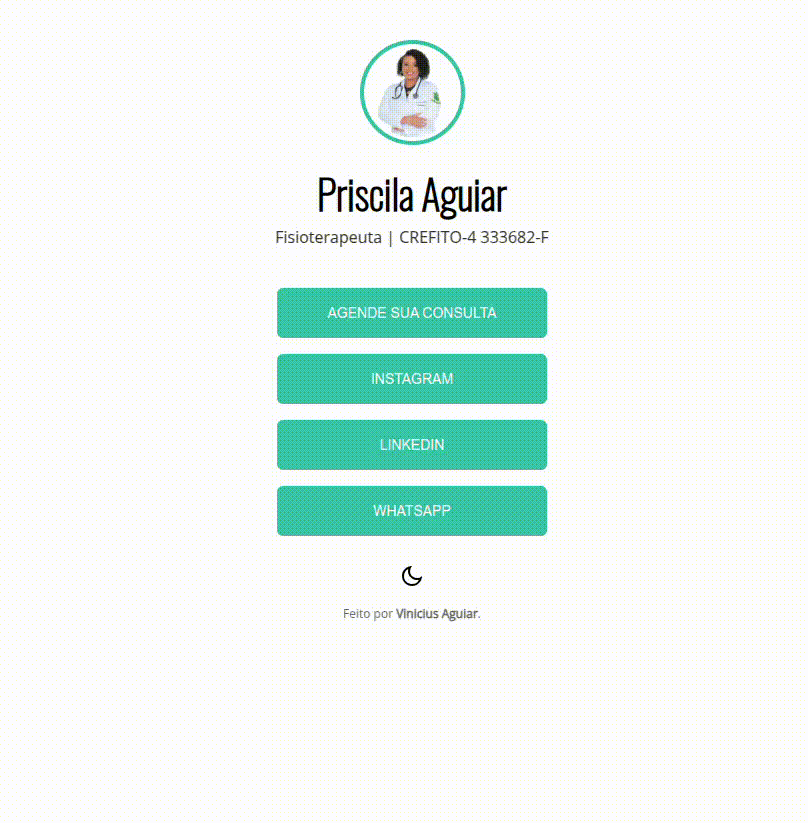

# Página de links - Fisioterapeuta Priscila Aguiar

 

> 🚀 <a href="https://vinimax001.github.io/links-priscila/">Acesse aqui</a>

## 💻 Sobre

Página de links, na propósta de ser usada para biografia no Instagram, feita para cliente, Fisioterapeuta Priscila Aguiar <a href="https://www.linkedin.com/in/priscila-cadete-96749b339/" target="_blank">Priscila Aguiar</a>

## 🧠 Tecnologias

    
    
    

 

---

<table>
  <tr>
    <td>
      
    </td>
    <td>
      Feito por <a href="https://github.com/vinimax001">Vinicius Aguiar.</a> 🙋🏿‍♂️
    </td>
  </tr>
</table>

